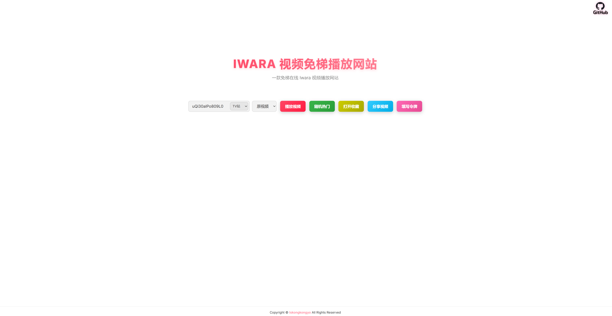

# 简单反代 Iwara（I 站）视频

一个用于部署 **Iwara 视频轻量反代/播放站** 的项目，支持三种方式：

- Cloudflare Worker 部署（推荐）
- 第三方反代部署（Node.js）
- 完全私有部署（Node.js / Python）

项目提供前端 `index.html`，并配套 Worker / Node / Python 后端代理实现。

---

## 项目主要文件说明

| 文件 / 目录 | 说明 |
| --- | --- |
| `index.html` | 前端页面（HTML/CSS/JS 单文件） |
| `sweetalert.min.js` | 前端弹窗库（本地文件） |
| `Worker部署/worker.js` | Cloudflare Worker 后端（内嵌前端页面模板） |
| `第三方反代部署/` | 基于第三方反代接口的 Node.js 部署方案 |
| `完全私有部署/Nodejs环境/` | Node.js 私有部署方案 |
| `完全私有部署/Python环境/` | Python 私有部署方案 |
| `preview.png` | 页面预览图 |

---

## 新增认证与 Token 机制（重要）

为防止滥用并避免与 Iwara 的 `Authorization` 请求头冲突，项目已支持以下机制：

### 1. 前端自定义 Token 请求头：`CustomizedToken`

前端在请求后端时不再使用 `Authorization` 发送 Iwara Token，而是改为：

- `CustomizedToken: Bearer xxxxx`

后端会读取 `CustomizedToken`，并在转发到 Iwara 时映射回：

- `Authorization: Bearer xxxxx`

这样就不会和 **Basic Auth** 的 `Authorization` 冲突。

### 2. 后端 Basic Auth（防滥用）

后端支持 Basic Auth 身份认证（浏览器会弹原生认证框）。

配置项（Worker / Node / Python 统一逻辑）：

- `BASIC_AUTH_USER`
- `BASIC_AUTH_PASS`

不配置（留空）时默认不启用 Basic Auth。

### 3. 后端默认 Iwara Token（可选）

后端可配置默认 Iwara Token（用于未填写前端 token 时兜底访问）：

- `IWARA_AUTHORIZATION`

支持以下两种写法（会自动标准化）：

- 原始 JWT（不带 `Bearer ` 前缀）
- `Bearer xxxxx`

系统会自动补全 `Bearer ` 前缀（自动 Bearer 标准化）。

### 4. Token 优先级（非常重要）

后端转发到 Iwara 时使用的 `Authorization` 优先级如下：

1. 前端 `CustomizedToken`（用户填写 token）
2. 后端环境变量 `IWARA_AUTHORIZATION`
3. Worker 代码中的默认 `DEFAULT_IWARA_AUTHORIZATION`（仅 Worker 方案可用，作为兜底）

### 5. 前端本地 Token 过期检测

前端页面访问时会自动检查用户本地保存的 token（`localStorage.token`）：

- 有效：不提示
- 过期/无效：弹窗提示并自动清除本地 token

### 6. 后端 Token 状态检测接口：`/token-status`

后端新增接口（Worker / Node / Python 均支持）：

- `GET /token-status`

返回规则：

- **后端未配置 token**：返回 `204 No Content`，并带 `Retry-After: 86400`（1天）
- **后端 token 有效**：返回 `204 No Content`
- **后端 token 过期**：返回 `200` JSON：
  - `{ "code": "backend_token_expired", "message": "后端设置的token已过期！" }`

前端会按 `Retry-After` 做本地节流，避免频繁请求。

说明：如果前端本地 token 有效，前端不会额外弹出“后端 token 已过期”的提示（避免误导用户）。

---

## 部署方式（推荐顺序）

## 1. Cloudflare Worker 部署（推荐）

优点：

- 无需服务器
- 部署快
- 可隐藏真实源站 IP
- 配置集中在 Worker 面板，便于维护认证信息

### 部署步骤

1. 打开 `Worker部署/worker.js`
2. 登录 Cloudflare，进入 `Workers & Pages`
3. 创建 Worker
4. 将 `worker.js` 内容粘贴到编辑器并保存部署
5. （强烈建议）绑定自定义域名

### Worker 配置方式（推荐使用面板环境变量）

你可以在 **Worker 代码默认值** 或 **Cloudflare Worker 面板环境变量** 中配置：

- `BASIC_AUTH_USER`
- `BASIC_AUTH_PASS`
- `IWARA_AUTHORIZATION`

推荐：把敏感信息配置在 **Worker 面板环境变量** 中，不写死在代码里。

### Worker 域名说明（中国大陆访问提示）

Cloudflare 默认 `*.workers.dev` 在部分网络环境下可能无法稳定访问（DNS 污染/拦截等问题）。

建议：

- 在 Cloudflare 中给 Worker 绑定自定义域名

---

## 2. 第三方反代部署（Node.js）

该方案依赖第三方接口（如 `api.allorigins.win`）进行部分请求转发，适合快速部署测试。

目录：`第三方反代部署/`

### 安装依赖

```bash
npm install express node-fetch cors
```

### 启动服务

```bash
node server.js
```

默认访问：

```bash
http://localhost:8000
```

### 可选环境变量（新增）

```bash
BASIC_AUTH_USER=your_user
BASIC_AUTH_PASS=your_pass
IWARA_AUTHORIZATION=your_iwara_token_or_bearer
```

说明：`IWARA_AUTHORIZATION` 支持填写原始 JWT，后端会自动补 `Bearer `。

---

## 3. 完全私有部署（Node.js / Python）

适合已有服务器、希望完全私有化部署的场景。

### Node.js 私有部署

目录：`完全私有部署/Nodejs环境/`

#### 安装依赖

```bash
npm install express node-fetch cors
```

#### 启动

```bash
node server.js
```

默认访问：

```bash
http://localhost:8000
```

#### 可选环境变量（新增）

```bash
BASIC_AUTH_USER=your_user
BASIC_AUTH_PASS=your_pass
IWARA_AUTHORIZATION=your_iwara_token_or_bearer
```

---

### Python 私有部署

目录：`完全私有部署/Python环境/`

#### 安装依赖

```bash
pip install -r requirements.txt
```

如无 `requirements.txt`，至少需：

```bash
pip install flask requests cloudscraper
```

#### 启动

```bash
python server.py
```

默认访问：

```bash
http://localhost:8000
```

#### 可选环境变量（新增）

```bash
BASIC_AUTH_USER=your_user
BASIC_AUTH_PASS=your_pass
IWARA_AUTHORIZATION=your_iwara_token_or_bearer
```

---

## 使用提示

### 前端填写 token（用户 token）

前端页面中的“填写令牌”按钮填写的是用户自己的 Iwara token：

- 会保存在浏览器本地 `localStorage`
- 页面访问时会自动检查是否过期
- 过期会提示并自动清除

### 后端默认 token（站点 token）

如果你希望站点默认就能播放某些需要登录的信息，可设置：

- `IWARA_AUTHORIZATION`

但请注意：

- 这是后端默认 token，会被所有访问者共享使用（除非用户自己填写了前端 token）
- 建议定期检查有效期（前端已通过 `/token-status` 自动检测）

---

## 示例站点（Cloudflare Worker）

以下示例使用自定义域名部署 Worker：

- https://ss.iys.pp.ua
- https://ss.ixq.pp.ua

---

## 页面示例



---

## 鸣谢

- [Iwara](https://www.iwara.tv)
- [Cloudflare](https://www.cloudflare.com/)
- [SweetAlert](https://sweetalert.js.org/)
- [gnuns](https://github.com/gnuns)
