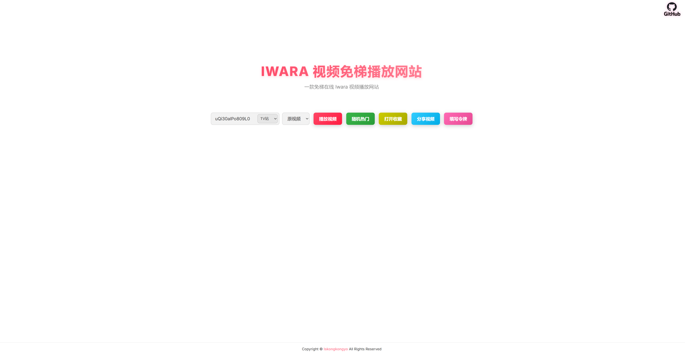

# 简单反代 Iwara（I 站）视频

**绕过限制，自由播放！** 这是一个专为 Iwara（I 站）设计的视频反代与播放解决方案，支持边缘计算与私有服务器部署，旨在提供极致的访问体验！

---

## 🌐  演示站点（传送门）

想要即刻体验？点击下方链接直接进入（由 Cloudflare Worker 驱动）：

- 🚀 [主演示站](https://ss.iys.pp.ua)
- 🛰 [备用演示站](https://ss.ixq.pp.ua)

------

## 📸 界面预览



------

## 📂  项目主要文件说明

| **文件 / 目录**        | **说明**                                                    |
| ---------------------- | ----------------------------------------------------------- |
| `index.html`           | **核心前端**：HTML/CSS/JS 单文件，无需复杂构建              |
| `sweetalert.min.js`    | **UI 组件**：提供优雅的前端弹窗交互                         |
| `Worker部署/worker.js` | **CF Worker 后端**：已内嵌前端模板，实现零服务器部署        |
| `第三方反代部署/`      | **混合方案**：基于 Node.js，通过第三方接口进行请求转发      |
| `完全私有部署/`        | **全控方案**：包含 Node.js 与 Python 两套环境，完全掌控流量 |

------

## 🛠 技术栈

| **模块**       | **使用技术**                                           |
| -------------- | ------------------------------------------------------ |
| **前端**       | HTML5, CSS3 (Modern UI), JavaScript (ES6+), SweetAlert |
| **Worker 版**  | Cloudflare Workers (V8 Runtime), Fetch API             |
| **Node.js 版** | Express.js, node-fetch, CORS                           |
| **Python 版**  | Flask, Requests, Cloudscraper (绕过检测)               |

------

## ✨ 新增认证与 Token 机制

为了防止站点滥用并确保与 Iwara 原生请求不冲突，项目引入了以下核心机制：

### 🔑 自定义 Token：`CustomizedToken`

- **前端逻辑**：不再直接发送 `Authorization` 头，而是使用 `CustomizedToken: Bearer xxxxx`。
- **后端逻辑**：后端会自动读取该请求头，并在转发时映射回 Iwara 要求的标准 `Authorization` 头。
- **优势**：完美避开 Basic Auth 带来的请求头冲突问题。

### 🛡 后端 Basic Auth (全局保护)

通过设置 `BASIC_AUTH_USER` 和 `BASIC_AUTH_PASS` 环境变量启用。

- **作用范围**：全局生效，保护包括首页、`/video*`、`/file*`、`/view` 等所有接口。
- **留空默认关闭**：不配置时默认无需密码访问。

### 🤖 智能 Token 处理

- **后端默认 Token**：可通过 `IWARA_AUTHORIZATION` 设置站点全局默认 Token。
- **标准化**：系统会自动处理 JWT，无论是否带 `Bearer ` 前缀都会被自动补全为标准格式。

### 🚦 Token 优先级 (由高到低)

1. 用户在前端页面自行填写的 `CustomizedToken`。
2. 后端环境变量中配置的 `IWARA_AUTHORIZATION`和Worker 代码中的硬编码默认值 `DEFAULT_IWARA_AUTHORIZATION`。

------

## 🛠 核心功能与安全

### 🔍 Token 状态监控：`/token-status`

后端新增接口用于实时监测后端 Token 有效性：

- **未配置时**：返回 `204 No Content`（带 1 天节流头）。
- **有效时**：返回 `204 No Content`。
- **已过期**：返回 JSON `{"code": "backend_token_expired", ...}`，前端将引导用户操作。

### 🚧 `/view` 严格安全规则

为防止后端 Token 被非法滥用，系统对播放链接实施强校验：

- **域名锁定**：必须匹配 `xxx.iwara.tv`。
- **路径校验**：必须严格为 `/view`。
- **参数校验**：必须含一个及以上查询字符串。
- **方法限制**：反代接口仅允许 `GET` 与 `OPTIONS` 方法，其余一律 `403`。

------

## 🚀 部署指南

### 🌟 A. Cloudflare Worker (推荐)

1. 复制 `Worker部署/worker.js` 内容。
2. 在 Cloudflare 后台创建新的 Worker 并粘贴代码。
3. **环境变量**：在面板中添加 `BASIC_AUTH_USER` 等变量（比改代码更安全）。
4. **注意**：建议绑定自定义域名，因为 `*.workers.dev` 在国内部分网络环境受限。

### 📦 B. Node.js 环境 (第三方或私有部署)

```Bash
# 进入对应目录后安装依赖
npm install express node-fetch cors
# 启动服务 (默认端口 8000)
node server.js
```

### 🐍 C. Python 环境

```Bash
# 安装必要组件
pip install flask requests cloudscraper
# 运行后端
python server.py
```

#### Node.js/Python可选环境变量（新增）

```bash
BASIC_AUTH_USER=your_user
BASIC_AUTH_PASS=your_pass
IWARA_AUTHORIZATION=your_iwara_token_or_bearer
```

------

## 💡 使用小贴士

- **前端 Token**：用户可自行点击“填写令牌”后设置！保存在本地 `localStorage`，系统会自动检测是否过期并弹窗提示，过期会提示并自动清除。
- **共享 Token**：如果你希望站点默认就能播放某些需要登录的信息，可设置后端 `IWARA_AUTHORIZATION` 。但请注意所有访客默认都能访问需要登录的内容，请务必配合 Basic Auth 使用（除非用户自己填写了前端 token）。
- **读取剪切板**：如果你授予网站“允许读取剪切板内容”的权限，网站会在初次加载、从其他页面切回项目页面（需用户点击页面任何内容）、从其他应用程序切回项目页面这三种情况下自动识别剪切板内容是否含Iwara网站视频链接。如果识别到剪切板内容有Iwara网站视频链接会给予提示！

------

## 🙏 鸣谢

感谢以下项目与平台提供的灵感与技术支持：

- [Iwara](https://www.iwara.tv)
- [Cloudflare](https://www.cloudflare.com/)
- [SweetAlert](https://sweetalert.js.org/)
- [gnuns](https://github.com/gnuns)