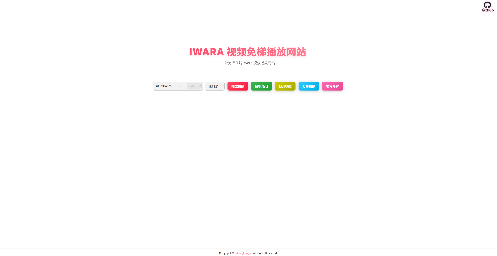

<h1 align="center">Iwara Video Proxy</h1>

<p align="center">
  
</p>

<p align="center">
  <strong>简单反代 Iwara · 绕过限制，自由播放！</strong>
</p>

<p align="center">
  一个支持 <strong>边缘计算、第三方反代与私有服务器部署</strong> 的 Iwara 视频代理及播放解决方案。
</p>

<p align="center">
  
  
  
  
  
</p>


> [!IMPORTANT]
> **Iwara 已新增 [AI 视频网站](https://www.iwara.ai)**。本项目已跟随更新，目前支持播放 **[www.iwara.tv](https://www.iwara.tv)** 与 **[www.iwara.ai](https://www.iwara.ai)** 两个站点的视频。

---

## 📖 目录

<p align="center">
  <a href="#demo">🌐 演示站点</a> ·
  <a href="#features">✨ 功能亮点</a> ·
  <a href="#preview">📸 界面预览</a> ·
  <a href="#files">📂 文件说明</a> ·
  <a href="#stack">🛠️ 技术栈</a> ·
  <a href="#auth">🔐 认证与 Token</a> ·
  <a href="#security">🛡️ 核心安全</a> ·
  <a href="#deploy">🚀 部署指南</a> ·
  <a href="#tips">💡 使用小贴士</a> ·
  <a href="#thanks">🙏 鸣谢</a>
</p>

---

<a id="demo"></a>

## 🌐 演示站点

想要立即体验？可直接访问以下由 **Cloudflare Worker** 驱动的演示站点：<a href="https://ss.ixq.pp.ua"><strong>🚀 主演示站</strong></a> · <a href="https://ss.iys.pp.ua"><strong>🛰️ 备用演示站</strong></a>

---

<a id="preview"></a>

## 📸 界面预览

<p align="center">
  
</p>

---

<a id="features"></a>

## ✨ 功能亮点

- 🌍 **双站点支持**：兼容 `www.iwara.tv` 与 `www.iwara.ai` 视频播放。
- ⚡ **多种部署方式**：支持 Cloudflare Worker、Node.js 与 Python 私有部署。
- 🔐 **前后端 Token 机制**：支持前端自定义 Token 与后端默认 Token，并按优先级自动选择。
- 🛡️ **全局访问保护**：可通过 Basic Auth 为站点及相关接口增加统一认证。
- 🔍 **Token 状态监控**：后端提供 `/token-status`，用于检测默认 Token 的配置与有效状态。
- 🔄 **Iwara 自动登录**：默认 Token 缺失、过期或被拒绝时，可由 Worker 安全刷新共享 Token。
- 📢 **远程通知**：可从 JSON 接口读取站点通知，支持每日一次、仅一次和用户关闭提示。
- 📊 **额度保护**：可查询 Cloudflare Analytics，在每日请求量接近上限时让新会话自动改用视频直连。
- 🚧 **播放接口安全校验**：`/view` 对域名、路径、查询参数和请求方法实施严格限制。
- 👥 **可选实时会话数**：Cloudflare Worker 可通过 Durable Objects + WebSocket 开启在线会话统计，并在用户交互或等待 8 秒后延迟连接。
- 📋 **剪切板链接识别**：在获得浏览器权限后，可自动识别剪切板中的 Iwara 视频链接并提示。

---

<a id="files"></a>

## 📂 项目主要文件说明

| 文件 / 目录 | 用途 |
| :-- | :-- |
| `index.html` | **核心前端**：HTML / CSS / JavaScript 单文件，无需复杂构建流程 |
| `sweetalert.min.js` | **UI 组件**：提供更友好的前端弹窗交互 |
| `Worker部署/` | **Cloudflare Worker 统一版**：可选开启全站实时会话数，无需维护两份 Worker 代码 |
| `第三方反代部署/` | **混合部署方案**：基于 Node.js，通过 CorsBridge 进行请求转发 |
| `完全私有部署/` | **完全私有方案**：提供 Node.js 与 Python 两套后端环境，便于完全掌控流量 |

---

<a id="stack"></a>

## 🛠️ 技术栈

| 模块 | 使用技术 |
| :-- | :-- |
| **前端** | HTML5、CSS3（Modern UI）、JavaScript（ES6+）、SweetAlert |
| **Worker 版** | Cloudflare Workers（V8 Runtime）、Fetch API |
| **Node.js 版** | Express.js、node-fetch、CORS |
| **Python 版** | Flask、Requests、Cloudscraper（绕过检测） |

---

<a id="auth"></a>

## 🔐 认证与 Token 机制

为了防止站点滥用，并避免与 Iwara 原生请求头产生冲突，项目提供了前后端协同的认证与 Token 处理机制。

### 🔑 自定义 Token：`CustomizedToken`

| 环节 | 处理方式 |
| :-- | :-- |
| **前端** | 不直接发送 `Authorization`，而是发送 `CustomizedToken: Bearer xxxxx` |
| **后端** | 自动读取 `CustomizedToken`，转发请求时映射回 Iwara 要求的标准 `Authorization` 请求头 |
| **目的** | 避免与 Basic Auth 使用的 `Authorization` 请求头发生冲突 |

### 🛡️ 后端 Basic Auth（全局保护）

通过环境变量 `BASIC_AUTH_USER` 与 `BASIC_AUTH_PASS` 启用。

- **作用范围**：全局生效，可保护首页、`/video*`、`/file*`、`/view` 等接口。
- **默认行为**：两个变量留空时不启用 Basic Auth，无需密码即可访问。

### 🤖 智能 Token 处理

- **后端默认 Token**：可通过 `IWARA_AUTHORIZATION` 设置站点级默认 Token。
- **Worker 自动登录**：同时配置 `IWARA_USERNAME` 与 `IWARA_PASSWORD` 后，默认 Token 缺失或已过期时会通过 Iwara 官方登录接口自动获取新 Token。
- **自动刷新**：上游明确返回 `401` 时，Worker 会重新登录并只重试原请求一次；并发登录会自动合并，失败后冷却 60 秒。
- **内存缓存**：自动获取的 Token 只缓存在当前 Worker 实例内，不写入浏览器、日志或项目文件；新实例会按需重新登录。
- **自动标准化**：系统会自动处理 JWT；无论是否包含 `Bearer ` 前缀，都会标准化为正确格式。

### 🚦 Token 优先级

优先级由高到低：

1. **前端 Token**：用户在页面中自行填写的 `CustomizedToken`。
2. **有效的后端默认 Token**：环境变量 `IWARA_AUTHORIZATION`，或 Worker 代码中的硬编码默认值 `DEFAULT_IWARA_AUTHORIZATION`。
3. **Worker 自动登录 Token**：默认 Token 缺失、过期或被上游拒绝时，通过 `IWARA_USERNAME` 与 `IWARA_PASSWORD` 获取。

> [!NOTE]
> 当前端已经提供 `CustomizedToken` 时，将优先使用用户自己的 Token，而不是后端默认 Token。

---

<a id="security"></a>

## 🛡️ 核心功能与安全

### 🔍 Token 状态监控：`/token-status`

后端提供 `/token-status` 接口，用于实时检测后端默认 Token 的状态：

| 状态 | 返回结果 |
| :-- | :-- |
| **未配置 Token** | `204 No Content`，并附带 1 天节流头 |
| **Token 有效** | `204 No Content` |
| **Token 已过期** | 返回 `{"code": "backend_token_expired", ...}`，前端据此引导用户处理 |
| **自动登录配置不完整** | 返回 `{"code": "backend_login_misconfigured", ...}` |
| **登录凭据被拒绝** | 返回 `backend_login_credentials_rejected`，前端明确提示检查登录邮箱和密码 |
| **接口响应缺少 Token** | 返回 `backend_login_invalid_response`，前端提示管理员检查接口变化 |
| **限流或上游暂时异常** | 返回 `backend_login_rate_limited`、`backend_login_upstream_blocked` 或 `backend_login_temporarily_unavailable`，进入约 60 秒冷却但不弹出误导性的配置错误提示 |

#### 自动登录排查

部署最新版后，请先确认变量确实绑定在**当前 Worker 与当前环境**：

```bash
cd Worker部署
npx wrangler secret list
```

列表中应同时出现 `IWARA_USERNAME` 和 `IWARA_PASSWORD`。如果使用 Wrangler 的命名环境，请在查看、设置 Secret 和部署时都带上相同的 `--env 环境名`。`IWARA_USERNAME` 会作为登录 JSON 的 `email` 字段发送，优先填写 Iwara 登录邮箱。

然后请求脱敏诊断接口。该请求本身会在需要时触发一次自动登录：

```bash
curl.exe -i "https://你的域名/token-status"
curl.exe -sS "https://你的域名/token-status?debug=1"
```

`?debug=1` 只返回变量是否存在、请求时间、HTTP 状态、响应类型、缓存状态和脱敏错误，不返回用户名、密码、Token 或上游响应正文。重点查看：

| 字段 | 如何判断 |
| :-- | :-- |
| `configured.username/password` | 两项都应为 `true`，否则 Secret 没有绑定到当前部署环境 |
| `autoLogin.attempted` | 为 `true` 表示已发起登录；已有有效 `IWARA_AUTHORIZATION` 时不会提前登录 |
| `lastResponseStatus` | `200` 通常表示接口接受请求；`400/401` 多为账号或接口参数问题；`403` 可能是上游风控拦截 |
| `lastResponseContentType` | 正常接口通常为 JSON；`403` 且为 `text/html` 通常表示返回了挑战页而不是登录 JSON |
| `authorizationSource` | `auto_login_cache` 表示自动登录 Token 已获取并在当前 Worker 实例缓存 |
| `cachedTokenAvailable` | 为 `true` 表示响应内找到了可用 Token |
| `failureReason` | 区分 `rate_limited`、`credentials_rejected`、`upstream_blocked`、`upstream_unavailable`、`network_error` 和 `invalid_response` |
| `retryAfterSeconds` | 失败后的剩余冷却秒数；最多约 60 秒 |

浏览器只会针对能够明确判断的配置问题、凭据被拒绝或登录响应缺少 Token 弹窗。`429` 限流、`403` 上游拦截、网络错误和上游 `5xx` 会静默等待后续请求自动恢复，避免出现“受限视频可以观看，但首页仍提示配置错误”的误报。

同时可在另一个终端实时查看 Worker 的脱敏日志：

```bash
cd Worker部署
npx wrangler tail --format pretty
```

触发 `/token-status?debug=1` 后，应依次看到 `request_started`、`response_received`，成功时再看到 `login_succeeded`，失败时则是 `login_failed`。日志刻意不记录请求体、密码、Token 和响应正文。如果启用了站点 Basic Auth，请先在浏览器登录，或在调试请求中提供对应的 Basic Auth；不要把 Iwara 密码当作站点 Basic Auth 密码。

### 📊 Worker 请求额度保护

Worker 可以使用 [Cloudflare GraphQL Analytics](https://developers.cloudflare.com/analytics/graphql-api/tutorials/querying-workers-metrics/) 查询当天请求量。根据 [Cloudflare Workers 官方限制](https://developers.cloudflare.com/workers/platform/limits/)，免费计划默认按每天 `100000` 次计算；剩余额度小于等于阈值时，**新打开的页面**会把视频播放地址切换为直连，视频信息与下载仍经过 Worker。

| 变量 | 用途 | 默认值 |
| :-- | :-- | :-- |
| `CF_ACCOUNT_TAG` | Cloudflare 账户 ID | 空 |
| `CF_ANALYTICS_API_TOKEN` | 具有 Analytics 读取权限的 API Token，必须使用 Secret | 空 |
| `CF_WORKER_SCRIPT_NAME` | 当前 Worker 脚本名称 | 空 |
| `WORKERS_DAILY_REQUEST_LIMIT` | 每日请求额度 | `100000` |
| `DIRECT_MODE_REMAINING_REQUESTS_THRESHOLD` | 进入直连模式的剩余请求数阈值 | `100` |
| `PLAYBACK_MODE_CACHE_TTL_SECONDS` | 请求量判断缓存时间 | `300` |
| `FORCE_PLAYBACK_MODE` | 手动指定 `proxy` 或 `direct`；留空时自动判断 | 空 |
| `NEW_SITE_URL` | 进入直连模式时提供的备用站点 | 空 |

未配置 Analytics 三项必要参数时会保持代理模式。可访问 `/playback-mode-debug` 查看判断结果；只有启用 Basic Auth 后，`?refresh=1` 才会绕过缓存重新查询，避免公开接口被滥用。

### 📢 远程通知

设置 `NOTICE_API_URL` 后，Worker 会读取并缓存通知 JSON。通知正文支持经过安全过滤的常用 HTML；同一通知默认每天最多出现一次，用户也可以选择“不再提示”。

```json
{
  "hasNotice": true,
  "noticeId": "maintenance-2026-09",
  "title": "维护通知",
  "content": "<h3>维护通知</h3><p>今晚 23:00 进行短暂维护。<br><a href=\"https://example.com/status\" target=\"_blank\">查看状态</a></p>",
  "showOnce": false
}
```

支持的常用标签包括 `h1`–`h6`、`p`、`br`、`a`、`img`、粗体/斜体、列表、引用、代码块、折叠内容和表格等。链接仅允许 HTTP(S)、邮箱、电话或站内相对地址；图片仅允许 HTTP(S) 或站内相对地址。`script`、`style`、`iframe`、表单、内联事件（如 `onclick`）、危险 URL 和未列入白名单的属性会被删除。

可通过 `NOTICE_API_CACHE_TTL_SECONDS` 调整缓存时间，默认 `300` 秒。`showOnce: true` 表示该浏览器仅显示一次；更换 `noticeId` 可以发布一条新通知。

### 🚧 `/view` 严格安全规则

为减少后端 Token 被非法滥用的风险，播放链接需要通过以下校验：

- **域名锁定**：必须匹配 `xxx.iwara.tv`。
- **路径校验**：路径必须严格为 `/view`。
- **参数校验**：必须包含一个及以上查询字符串。
- **方法限制**：仅允许 `GET` 与 `OPTIONS`，其余请求方法统一返回 `403`。

---

<a id="deploy"></a>

## 🚀 部署指南

### 🌟 A. Cloudflare Worker（推荐）

Worker 已合并为一份统一代码，会根据是否绑定 `ONLINE_COUNTER` 自动切换运行模式：

| 模式 | Durable Object | 实时用户会话数 | WebSocket |
| :-- | :--: | :--: | :--: |
| **无会话模式（默认）** | ❌ | ❌ | ❌ |
| **有会话模式** | ✅ `ONLINE_COUNTER` | ✅ | ✅ |

#### ☁️ 一键部署（默认无会话）

<p align="center">
  <a href="https://deploy.workers.cloudflare.com/?url=https://github.com/Iskongkongyo/iwaraVideoProxy/tree/main/Worker%E9%83%A8%E7%BD%B2">
    
  </a>
</p>

部署时登录 Cloudflare，按页面提示选择账号、修改 Worker 名称并完成部署即可。

Cloudflare 会从 `Worker部署` 子目录读取：

- `wrangler.toml`
- `worker.js`

默认配置**不会创建 Durable Object**。

> [!TIP]
> 一键部署完成后，可在 Cloudflare 控制台的 `设置 → 变量和机密` 中按需添加 `BASIC_AUTH_USER`、`BASIC_AUTH_PASS` 与 `IWARA_AUTHORIZATION`。自动登录使用的 `IWARA_USERNAME`、`IWARA_PASSWORD` 必须保存为**机密**。
>
> 如需开启实时会话数，请在新建的 Git 仓库中取消 `wrangler.toml` 对应配置的注释，然后重新部署。

#### 🧩 无会话模式：面板部署

1. 复制 `Worker部署/worker.js` 的完整内容。
2. 打开 [Cloudflare 控制台](https://dash.cloudflare.com/login)，创建新的 Worker，粘贴代码并部署；此模式无需设置 Durable Object。
3. 配置环境变量。支持以下两种方式：

**方式一：直接修改 `worker.js` 默认值**

```js
const DEFAULT_BASIC_AUTH_USER = ''; // 设置访问用户名
const DEFAULT_BASIC_AUTH_PASS = ''; // 设置访问密码
const DEFAULT_IWARA_AUTHORIZATION = ''; // 设置默认使用的 Iwara 账号 Token
const DEFAULT_NOTICE_API_URL = ''; // 设置通知接口 URL
const DEFAULT_NEW_SITE_URL = ''; // 设置直连模式提示的备用站点
```

**方式二：使用 Worker 环境变量（更推荐）**

在 Worker 面板中添加：

```text
BASIC_AUTH_USER
BASIC_AUTH_PASS
IWARA_AUTHORIZATION
NOTICE_API_URL
```

如需自动登录，请另外添加以下两个变量，并将类型设置为**机密**：

```text
IWARA_USERNAME
IWARA_PASSWORD
```

`IWARA_USERNAME` 会作为登录接口 JSON 中的 `email` 字段提交，建议填写 Iwara 登录邮箱。若配置后没有生效，请参考上方“自动登录排查”。

请求额度自动保护还需要配置 `CF_ACCOUNT_TAG`、`CF_WORKER_SCRIPT_NAME`，并将 `CF_ANALYTICS_API_TOKEN` 保存为机密。其余阈值、缓存和备用站点变量可参考上方“Worker 请求额度保护”表格。

配置路径：

```text
构建 → Compute → Workers 和 Pages → 设置 → 变量和机密
```

填写需要的环境变量后重新部署即可。

> [!WARNING]
> 建议为 Worker 绑定自定义域名，因为 `*.workers.dev` 在国内部分网络环境中可能受限。

#### 👥 有会话模式：Wrangler 部署

1. 安装 [Node.js](https://nodejs.org/zh-cn/download) **20 或更高版本**，然后进入 `Worker部署` 目录。
2. 打开 `wrangler.toml`，修改 `name`。
3. 取消 `durable_objects.bindings` 与 `migrations` 两段配置的注释。
4. 两段配置必须**同时启用**，绑定名称保持为 `ONLINE_COUNTER`。

> [!NOTE]
> 实时会话数使用 **Cloudflare Durable Objects** 与**休眠 WebSocket**。实际额度及用量请以 Cloudflare 控制台和[官方配置文档](https://developers.cloudflare.com/workers/wrangler/configuration/#durable-objects)为准。

安装 Wrangler：

```bash
npm install -D wrangler@latest
```

登录并部署：

```bash
npx wrangler login
npx wrangler deploy
```

自动登录凭据建议通过 Wrangler Secret 设置，不要写入 `wrangler.toml`：

```bash
npx wrangler secret put IWARA_USERNAME
npx wrangler secret put IWARA_PASSWORD
npx wrangler secret put CF_ANALYTICS_API_TOKEN
```

登录命令会打开浏览器完成授权。

如之后希望关闭实时会话数，只需重新注释 `wrangler.toml` 中上述两段配置并再次部署，**无需更换 `worker.js`**。

### 📦 B. Node.js 环境（第三方或私有部署）

进入对应目录后安装依赖并启动服务：

```bash
npm install express node-fetch cors
node server.js
```

默认服务端口为 `8000`。

### 🐍 C. Python 环境

安装所需依赖并启动后端：

```bash
pip install flask requests cloudscraper
python server.py
```

### ⚙️ Node.js / Python 可选环境变量

```bash
BASIC_AUTH_USER=your_user
BASIC_AUTH_PASS=your_pass
IWARA_AUTHORIZATION=your_iwara_token_or_bearer
```

| 环境变量 | 用途 |
| :-- | :-- |
| `BASIC_AUTH_USER` | Basic Auth 用户名 |
| `BASIC_AUTH_PASS` | Basic Auth 密码 |
| `IWARA_AUTHORIZATION` | 后端默认使用的 Iwara Token |

---

<a id="tips"></a>

## 💡 使用小贴士

### 🔑 前端 Token

用户可以点击页面中的 **“填写令牌”** 自行设置 Token。

Token 会保存在浏览器本地 `localStorage` 中；系统会自动检测是否过期，在过期时弹窗提示并自动清除失效 Token。

### 🔐 共享 Token

如果希望站点默认即可播放部分需要登录才能访问的内容，可以配置后端 `IWARA_AUTHORIZATION`。

> [!WARNING]
> 配置共享 Token 后，所有访客默认都可能借助该 Token 访问需要登录的内容。除非用户自行填写前端 Token，否则建议务必配合 **Basic Auth** 使用。

启用 Worker 自动登录时同样属于共享账号能力。建议使用专用 Iwara 账号、开启 Worker 的 Basic Auth，并仅通过 Cloudflare Secret 保存登录凭据。自动登录接口若遇到账号错误、Iwara 限流或 Cloudflare 风控，页面会提示站点管理员检查配置；公开内容仍会尝试以无 Token 模式访问。

### 📋 剪切板自动识别

在用户授予网站**读取剪切板内容**权限后，页面会在以下场景尝试识别剪切板中是否存在 Iwara 视频链接：

1. 页面初次加载时。
2. 从其他页面切回项目页面时（需要用户点击页面任意位置）。
3. 从其他应用程序切回项目页面时。

识别到有效的 Iwara 视频链接后，页面会给予提示。

> [!NOTE]
> - 处于视频播放界面时，剪切板读取功能会被抑制。
> - 如果剪切板中的 Iwara 视频链接对应的视频 ID 与当前输入框内的视频 ID 一致，则会直接跳过弹窗提示。

---

<a id="thanks"></a>

## 🙏 鸣谢

感谢以下项目与平台提供的灵感与技术支持：

- [Iwara](https://www.iwara.tv)
- [Cloudflare](https://www.cloudflare.com/)
- [SweetAlert](https://sweetalert.js.org/)
- [gnuns](https://github.com/gnuns)

---

<p align="center">
  <strong>Iwara Video Proxy</strong><br>
  简单、灵活、可自托管的 Iwara 视频代理与播放方案。
</p>
